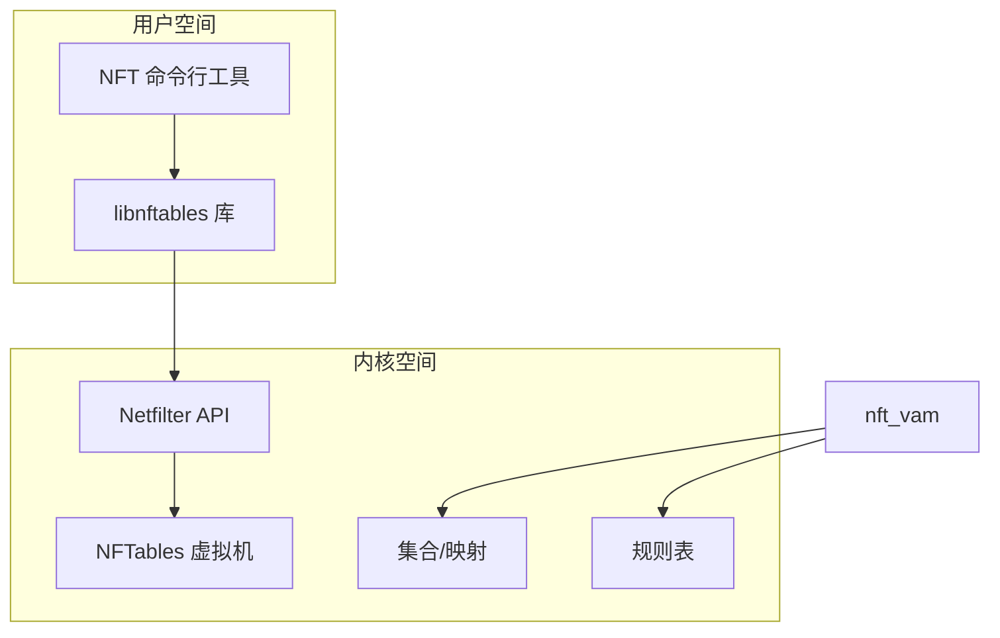

# 一、NFTables 概述

## 1.1 什么是 NFTables

NFTables 是 Linux 内核中的包过滤框架，旨在替代已使用多年的 iptables。它首次出现在 Linux 3.13 内核中，由 Netfilter 项目开发。

## 1.2 设计目标

- **统一语法**：统一 IPv4、IPv6、ARP 和桥接的过滤规则
- **简化配置**：提供更简洁、更易读的配置语法
- **更好的性能**：改进的数据结构和处理机制
- **动态规则更新**：支持原子规则更新
- **更好的扩展性**：原生支持集合和映射

---

# 二、NFTables 架构原理

## 2.1 核心组件

```text
表 (Table) → 链 (Chain) → 规则 (Rule)
    ↓
  集合 (Set) 和 映射 (Map)
```

## 2.2 与 Netfilter 的关系



## 2.3 规则处理流程

1. 数据包到达网络接口
2. 经过 Netfilter 钩子点
3. NFTables 规则链处理
4. 根据匹配执行相应动作

# 三、NFTables 基本概念详解

## 3.1 表 (Table)

```bash
# 语法
nft add table <family> <name> [flags]

# 示例
nft add table ip filter
nft add table ip6 filter6
nft add table inet global   # 同时处理 IPv4 和 IPv6
nft add table bridge bridge-filter
```

**地址族 (family):**

- `ip`: IPv4
- `ip6`: IPv6
- `inet`: IPv4 和 IPv6
- `arp`: ARP
- `bridge`: 桥接
- `netdev`: 网络设备层

## 3.2 链 (Chain)

```bash
# 语法
nft add chain [<family>] <table> <name> { type <type> hook <hook> priority <priority> \; [policy <policy>] \; }

# 示例
nft add chain ip filter input {
    type filter hook input priority 0; policy drop;
}

nft add chain ip filter forward {
    type filter hook forward priority 0; policy accept;
}
```

**链类型:**

- `filter`: 过滤链
- `route`: 路由链
- `nat`: NAT 链

**钩子点:**

- `prerouting`: 路由前
- `input`: 输入
- `forward`: 转发
- `output`: 输出
- `postrouting`: 路由后

**优先级:** 数值越小优先级越高

## 3.3 规则 (Rule)

```bash
# 语法
nft add rule [<family>] <table> <chain> <matches> <statement>

# 示例
nft add rule ip filter input ip saddr 192.168.1.0/24 accept
nft add rule ip filter input tcp dport {22, 80, 443} accept
```

## 3.4 集合 (Set)

```bash
# 创建命名集合
nft add set ip filter allowed_ips { type ipv4_addr; }

# 添加元素
nft add element ip filter allowed_ips { 192.168.1.1, 192.168.1.2 }

# 在规则中使用
nft add rule ip filter input ip saddr @allowed_ips accept
```

## 3.5 映射 (Map)

```bash
# 创建映射
nft add map ip filter port_map { type inet_service : verdict; }

# 添加映射项
nft add element ip filter port_map { 80 : accept, 22 : drop }

# 在规则中使用
nft add rule ip filter input tcp dport vmap @port_map
```

---

# 四、NFTables 完整配置示例

## 4.1 基本防火墙配置

```bash
#!/usr/sbin/nft -f

flush ruleset

table inet filter {
    # 定义集合
    set allowed_ips {
        type ipv4_addr
        elements = { 192.168.1.0/24, 10.0.0.0/8 }
    }

    set ssh_ports {
        type inet_service
        elements = { 22, 2222 }
    }

    # 定义链
    chain input {
        type filter hook input priority 0; policy drop;

        # 允许本地回环
        iif lo accept

        # 允许已建立的连接
        ct state established,related accept

        # 允许特定IP访问SSH
        ip saddr @allowed_ips tcp dport @ssh_ports accept

        # 允许所有ICMP
        ip protocol icmp accept

        # 记录并拒绝其他
        log prefix "Dropped input: " group 0
    }

    chain forward {
        type filter hook forward priority 0; policy drop;
    }

    chain output {
        type filter hook output priority 0; policy accept;
    }
}
```

## 4.2 NAT 配置

```bash
table ip nat {
    chain prerouting {
        type nat hook prerouting priority -100;

        # 端口转发
        tcp dport 80 dnat to 192.168.1.10:8080

        # 负载均衡
        tcp dport 443 dnat to { 192.168.1.11, 192.168.1.12 }
    }

    chain postrouting {
        type nat hook postrouting priority 100;

        # 源地址转换
        oif eth0 masquerade
    }
}
```

---

# 五、NFTables 高级特性

## 5.1 流量整形

```bash
# 限制上传速度
nft add rule ip filter output ip daddr != 192.168.1.0/24 \
    limit rate 1024 kbytes/second burst 5 mbytes accept

# 限制连接数
nft add rule ip filter input tcp dport 22 \
    ct count 3 accept
```

## 5.2 连接跟踪

```bash
# 仅允许指定数量的连接
nft add rule ip filter input tcp dport 80 \
    ct state new limit rate 10/minute accept

# 限制每个IP的连接数
nft add rule ip filter input tcp dport 80 \
    ct state new add @conn_limit { ip saddr limit rate 5/minute } accept
```

## 5.3 日志记录

```bash
# 基本日志
nft add rule ip filter input tcp dport 22 \
    log prefix "SSH attempt: " group 0 level info accept

# 带限制的日志
nft add rule ip filter input tcp flags syn \
    log prefix "SYN flood: " group 0 level warn limit rate 5/minute
```

---

# 六、NFTables vs iptables 详细对比

## 6.1 架构对比

| 特性 | iptables | NFTables |
|------|----------|----------|
| **架构** | 线性表结构 | 链表+集合+映射 |
| **规则处理** | 顺序匹配 | 更灵活的组合 |
| **内核模块** | 大量独立模块 | 统一框架 |
| **原子更新** | 不支持 | 支持 |

## 6.2 语法对比

**iptables:**

```bash
iptables -A INPUT -s 192.168.1.0/24 -p tcp --dport 22 -j ACCEPT
iptables -A INPUT -p tcp --dport 80 -j ACCEPT
iptables -A INPUT -j DROP
```

**NFTables:**

```bash
nft add rule ip filter input ip saddr 192.168.1.0/24 tcp dport 22 accept
nft add rule ip filter input tcp dport 80 accept
nft add rule ip filter input drop
```

## 6.3 性能对比

| 场景 | iptables | NFTables | 优势 |
|------|----------|----------|------|
| 大量规则 | O(n) 线性查找 | O(1) 集合查找 | NFTables 更快 |
| 规则更新 | 需要重启 | 原子更新 | NFTables 更高效 |
| 内存使用 | 较高 | 较低 | NFTables 更优 |

## 6.4 功能特性对比

| 特性 | iptables | NFTables |
|------|----------|----------|
| IPv4/IPv6 统一 | 需要 iptables/ip6tables | 统一配置 |
| 集合支持 | 有限 (ipset) | 原生支持 |
| 映射支持 | 不支持 | 原生支持 |
| 动态更新 | 部分支持 | 完整支持 |
| 日志记录 | 有限 | 增强 |

---

# 七、迁移指南：iptables 到 NFTables

## 7.1 转换工具

```bash
# 安装转换工具
apt install iptables-nftables-compat

# 转换规则
iptables-translate -A INPUT -p tcp --dport 22 -j ACCEPT
# 输出: nft add rule ip filter input tcp dport 22 accept

# 保存现有规则
iptables-save > iptables.rules
iptables-restore-translate -f iptables.rules > nftables.rules
```

## 7.2 常见转换示例

**iptables:**

```bash
iptables -N MY_CHAIN
iptables -A INPUT -j MY_CHAIN
iptables -A MY_CHAIN -s 192.168.1.0/24 -j ACCEPT
```

**NFTables:**

```bash
nft add chain ip filter MY_CHAIN
nft add rule ip filter input jump MY_CHAIN
nft add rule ip filter MY_CHAIN ip saddr 192.168.1.0/24 accept
```

---

# 八、最佳实践和调优

## 8.1 性能优化建议

```bash
# 1. 使用集合减少规则数量
nft add set ip filter fast_path { type ipv4_addr; }
nft add element ip filter fast_path { 10.0.0.0/8, 192.168.0.0/16 }
nft add rule ip filter input ip saddr @fast_path accept

# 2. 使用映射优化端口匹配
nft add map ip filter port_policy { 
    type inet_service : verdict 
}
nft add element ip filter port_policy { 
    80 : accept, 443 : accept, 22 : accept 
}
nft add rule ip filter input tcp dport vmap @port_policy

# 3. 尽早返回常用流量
nft add rule ip filter input ct state established,related accept
```

## 8.2 配置管理

```bash
# 保存配置
nft list ruleset > /etc/nftables.conf

# 恢复配置
nft -f /etc/nftables.conf

# 测试配置
nft -c -f /etc/nftables.conf

# 原子规则更新
nft -f new-rules.nft
```

## 8.3 监控和调试

```bash
# 查看规则统计
nft list ruleset -a

# 监控数据包计数
nft reset counters
nft list ruleset

# 调试规则
nft --debug=netlink add rule ...
nft monitor trace
```

---

# 九、常见问题解决

## 9.1 规则不生效

```bash
# 检查规则顺序
nft list chain ip filter input -a

# 检查计数器
nft list ruleset -nn

# 检查内核支持
cat /proc/net/netfilter/nf_tables
```

## 9.2 性能问题

```bash
# 检查规则数量
nft list ruleset | wc -l

# 检查集合使用
nft list sets

# 优化建议
# 1. 合并相似规则
# 2. 使用集合和映射
# 3. 减少复杂匹配
```

---

# 十、未来发展趋势

## 10.1 eBPF 集成

NFTables 正在与 eBPF 集成，提供更强大的可编程能力：

```bash
# 未来可能的语法
nft add rule ip filter input tcp dport 80 \
    bpf bytecode "..." accept
```

## 10.2 云原生支持

- 容器网络策略
- Kubernetes CNI 集成
- 服务网格集成

## 10.3 扩展功能

- 更丰富的协议支持
- 更智能的流量分析
- 机器学习集成

---

# 总结

NFTables 作为 iptables 的现代化替代品，提供了更简洁的语法、更好的性能和更强的功能。虽然学习曲线相对陡峭，但其统一性、可扩展性和性能优势使其成为现代 Linux 系统的理想选择。

## 选择建议：

- **新系统**：直接使用 NFTables
- **现有系统**：逐步迁移到 NFTables
- **复杂场景**：优先考虑 NFTables（集合、映射、性能）
- **简单场景**：iptables 仍可使用，但建议学习 NFTables

## 学习路径：

1. 理解 NFTables 基本概念（表、链、规则）
2. 掌握基本配置语法
3. 学习集合和映射的使用
4. 实践复杂策略配置
5. 了解性能优化技巧
