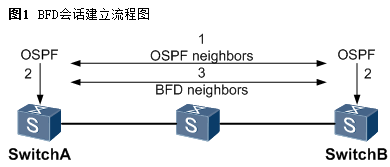
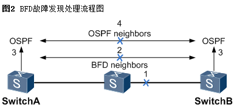
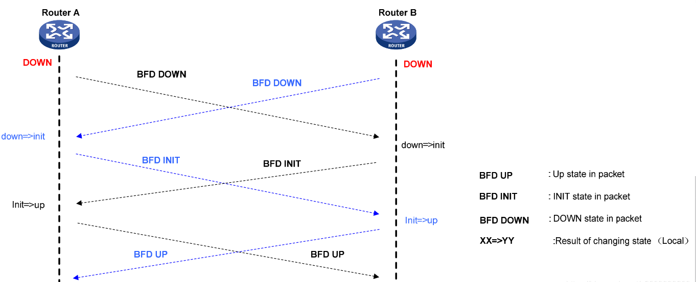
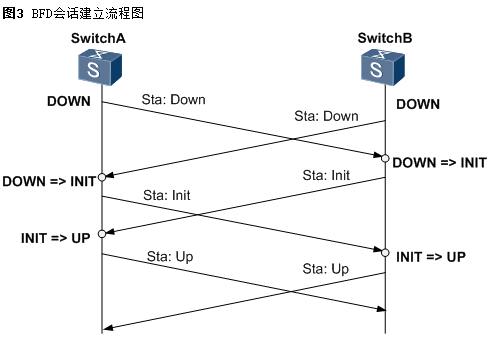
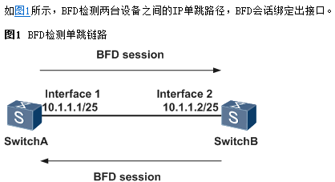
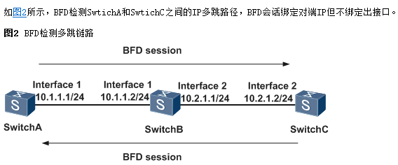

BFD，英文全称`Bidirectional Forwarding Detection`，中文意思是**双向转发检测**，这是一种全网统一的检测机制，用于快速检测、监控网络中链路或者 IP 路由的转发连通状况。

为了保护关键应用，网络中会设计有一定的冗余备份链路，网络发生故障时就要求网络设备能够快速检测出故障并将流量切换至备份链路以加快网络收敛速度。

目前有些链路具备硬件检测机制来快速故障检测，但某些链路（如以太网链路）不具备这样的检测功能。这种情况下就需要上层协议自身的机制来进行故障检测。但大部分协议如 OSPF，BGP 等检测链路故障的速度都很慢，最快也需要 1s 的时间，而且这些功能只针对本协议有效，无法为其他的协议或者应用提供快速检测机制。这对于某些实时性较高的上层应用如音频，视频等是不能接受的。

BFD 就是在这种背景下产生的，它提供了一个通用的标准化的介质无关和协议无关的检测机制。

# 1. 原理

## BFD 会话建立流程

BFD 在两台网络设备上建立会话，用来检测网络设备间的双向转发路径，为上层应用服务。会话建立后会周期性地快速发送 BFD 报文，如果在检测时间内没有收到 BFD 报文则认为该双向转发路径发生了故障，通知被服务的上层应用进行相应的处理。

BFD 协议本身没有邻居发现机制，BFD 邻居的创建依赖于上层的应用。根据 BFD 会话建立过程可以将其分为动态 BFD 和静态 BFD。

-   上层协议通过自己的 Hello 机制发现邻居并建立连接；

-   上层协议在建立了新的邻居关系时，将邻居的参数及检测参数都（包括目的地址和源地址等）通告给 BFD；

-   BFD 根据收到的参数进行计算并建立邻居。

## BFD 故障处理流程

-   链路故障时

-   bfd 检测到故障，将 bfd 会话变为 down

-   bfd 通知上层应用链路失效

-   上层应用做相应的措施

# 2. 会话建立方式

-   **动态 BFD**：是通过上层应用(例如 OSPF)的邻居发现机制，有上层应用将邻居信息发送到 BFD 模块，BFD 则根据接收到的邻居信息创建会话并建立自己的邻居。

-   **静态 BFD**：是通过静态配置手动添加对端的邻居信息来创建会话，静态 BFD 配置完后，会定时发送 BFD 控制报文。只有对端接口也开启 BFD 的情况下并对本端的 BFD 报文做出正确应答后，双方建立邻居信息。

## 区别

在于本地标识符合远端标识符的配置方式不同。

-   **静态 bfd 会话**，手工下发 bfd 会话建立请求。

-   **动态 bfd 会话**，本地标识动态分配本地标识符通过 bfd 控制报文协商而来。

# 3. 检测机制

一共有两种检测模式：

-   **异步模式**：BFD 的主要模式。通过相互周期性地发 BFD 控制报文，判断会话状态，当连续多个报文没有收到，就认为 BFD 会话状态 Down 了。

-   **查询模式**：当一个系统中存在大量 BFD 会话时，为防止周期性发送 BFD 控制报文影响到系统的正常运行，可以采用查询模式。不再周期性发送 BFD 控制报文，是通过与 BFD 无关的机制检测连通性（比如路由协议的 Hello 机制、硬件检测机制等），减少 BFD 会话的开销。

通过 BFD 会话，周期性发送 BFD 控制报文，在指定时间内没有收到 BFD 控制报文，则认为路径上发生故障。

# 4. 会话管理（4 种状态）

BFD 共有 4 种类型的控制报文维持 BFD 状态，分别为：**BSM_AdminDown**、**BSM_Down**、**BSM_Init**、**BSM_Up**

-   互发 down 报文，收到对方的 down 后，迁移到 init 状态

-   互发 init 报文，收到对方的 init 报文后就迁移到 UP

# 5. 应用场景

BFD 检测 IP 链路

