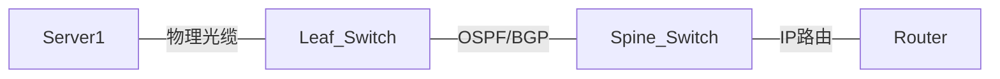
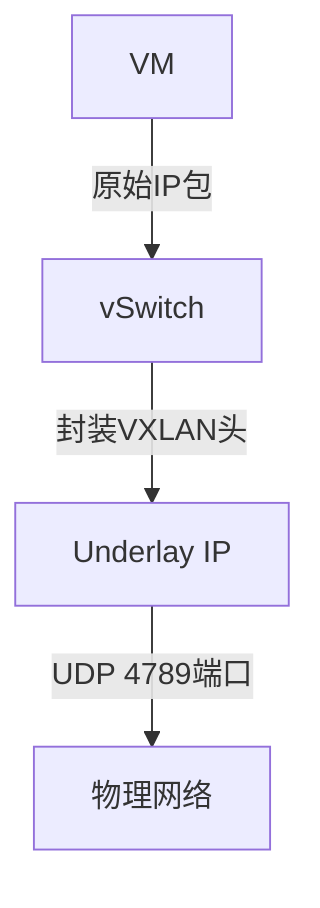
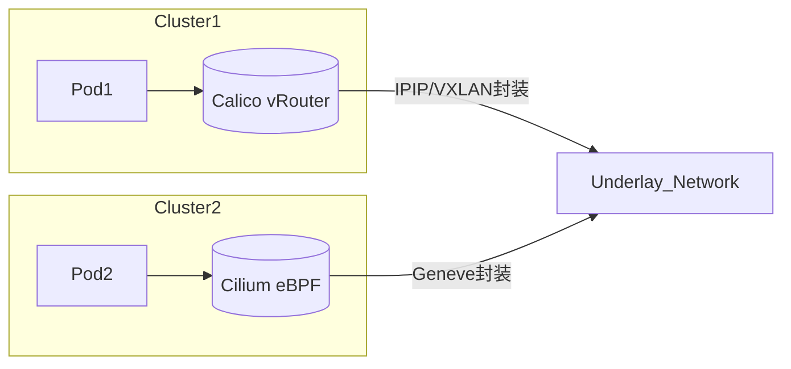
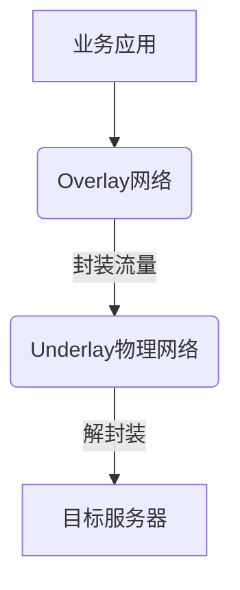

理解 Underlay 与 Overlay 网络的关键在于 ​**​ 分层架构思想 ​**​，它们是实现现代云网络（OpenStack/K8s 等）的核心技术栈。以下从原理到实践的深度解析：

# ​​ 1. 本质定义与核心区别 ​​

| ​**​ 维度 ​**​     | ​**​Underlay 网络 ​**​             | ​**​Overlay 网络 ​**​               |
| ------------------ | ---------------------------------- | ----------------------------------- |
| ​**​ 定位 ​**​     | 底层物理传输网络                   | 上层虚拟业务网络                    |
| ​**​ 工作层次 ​**​ | L1 物理层/L2 数据链路层/L3 网络层  | L4 传输层及以上（VXLAN/GRE 等封装） |
| ​**​ 核心目标 ​**​ | 提供稳定、低延迟的物理连通性       | 实现逻辑隔离的虚拟网络平面          |
| ​**​ 控制主体 ​**​ | 物理交换机/路由器（如 BGP/OSPF）   | 软件控制器（如 OpenStack Neutron）  |
| ​**​ 地址空间 ​**​ | 物理设备 IP（如 192.168.100.0/24） | 虚拟网络 IP（如 10.0.0.0/16）       |
| ​**​ 隔离机制 ​**​ | VLAN/物理端口隔离                  | VXLAN ID/GRE Key 等逻辑标识         |

> ​**​ 形象比喻 ​**​：
>
> -   ​**​Underlay​**​ = 高速公路系统（路基、桥梁、隧道）
> -   ​**​Overlay​**​ = 物流公司的运输路线（在高速路上灵活规划运输通道）

# ​​ 2. 技术原理深度解析 ​​

## ​Underlay 工作原理 ​​



-   ​**​ 基础功能 ​**​：传输原始以太网帧/IP 数据包（无封装）
-   ​**​ 关键协议 ​**​：
    -   二层：STP/EtherChannel
    -   三层：OSPF/BGP/静态路由
-   ​**​ 性能要求 ​**​：低延迟、高带宽（如 100G 端口+ECMP 负载均衡）

## ​Overlay 封装原理（以 VXLAN 为例）​​



-   ​**​ 封装格式 ​**​：

    ```
    | 外层MAC | 外层IP头 | UDP头 | VXLAN头 | 内层MAC | 内层IP头 | 原始数据 |
    ```

-   ​**​ 核心组件 ​**​：
    -   ​**​VTEP (VXLAN Tunnel Endpoint)​**​：封装/解封装设备（如 OVS/hypervisor）
    -   ​**​VNI (VXLAN Network Identifier)​**​：24 位 ID（支持 1600 万隔离网络）

# ​3. 典型应用场景 ​​

## ​ 场景 1：OpenStack 多租户网络 ​​

| ​**​ 层 ​**​     | ​**​ 实现技术 ​**​            | ​**​ 案例说明 ​**​                 |
| ---------------- | ----------------------------- | ---------------------------------- |
| ​**​Underlay​**​ | 物理交换机（Spine-Leaf 架构） | 数据中心 CLOS 架构，运行 eBGP+ECMP |
| ​**​Overlay​**​  | Neutron+VXLAN/GRE             | 租户 A 创建私有网络 VNI=10001      |

​**​OpenStack 配置片段 ​**​：

```ini
# 启用VXLAN的Neutron配置
[ml2]
type_drivers = vxlan,vlan
tenant_network_types = vxlan

[ml2_type_vxlan]
vni_ranges = 10000:20000

[ovs]
bridge_mappings = physnet1:br-ex
```

## ​​ 场景 2：Kubernetes 多集群组网 ​​



​**​CNI 方案对比 ​**​：

| ​**​CNI​**​ | ​**​Overlay 类型 ​**​ | ​**​ 适用场景 ​**​  |
| ----------- | --------------------- | ------------------- |
| Calico      | IP-in-IP              | 跨 AZ 中等规模集群  |
| Cilium      | Geneve                | 大规模 Service Mesh |
| Flannel     | VXLAN                 | 简单 Pod 网络       |

# ​ 4. 关键差异总结 ​​

| ​**​ 对比项 ​**​     | ​**​Underlay​**​                  | ​**​Overlay​**​               |
| -------------------- | --------------------------------- | ----------------------------- |
| ​**​ 扩展性 ​**​     | 受物理设备表项限制（如 FIB 大小） | 逻辑隔离，轻松扩展（VNI 池）  |
| ​**​IP 地址规划 ​**​ | 需全局统一规划（防冲突）          | 虚拟网络可重叠 IP（NAT 穿越） |
| ​**​ 运维复杂度 ​**​ | 需专业网络工程师调试              | 云平台自动部署（API 驱动）    |
| ​**​ 迁移灵活性 ​**​ | 拓扑变更需物理调整                | VM/Pod 跨物理机无缝迁移       |
| ​**​ 故障排查 ​**​   | 物理链路检测（LLDP/CDP）          | 需抓包解析封装头（tcpdump）   |

# ​​ 5. 协作关系与部署实践 ​​

## ​​ 分层协作模型 ​​



-   ​**​Golden Rule​**​：  
     ​**​Underlay 决定网络可靠性，Overlay 决定业务灵活性 ​**​

## ​​ 部署实践要点 ​​

### ​Underlay 优化建议 ​

-   Spine-Leaf 架构使用 ECMP（等价多路径）
-   MTU ≥ 1550 字节（适应 VXLAN 封装开销）
-   PFC+ECN 防止丢包（RDMA/RoCE 场景必需）

### Overlay 选型指南 ​

| ​**​ 场景 ​**​      | ​**​ 推荐协议 ​**​ |
| ------------------- | ------------------ |
| 跨数据中心延伸网络  | VXLAN-EVPN         |
| K8s 轻量级 Pod 网络 | IP-in-IP           |
| 金融低延迟交易系统  | SR-MPLS            |

# ​​ 6. 前沿演进方向 ​​

-   ​**​Underlay 智能运维 ​**​：

    -   Telemetry 采集物理网卡丢包率
    -   AIOps 预测带宽瓶颈（如 Inband Network Telemetry）

-   ​**​Overlay 性能优化 ​**​：
    -   ​**​ 硬件卸载 ​**​：NVIDIA BlueField DPU 处理 VXLAN 封装
    -   ​**​ 协议革新 ​**​：GENEVE 取代 VXLAN（可扩展 TLV 头部）
    -   ​**​ 零信任集成 ​**​：Cilium Overlay + WireGuard 加密隧道

> ​**​ 最终建议 ​**​：在私有云场景优先采用 ​**​VXLAN Overlay + BGP Underlay​**​ 方案，公有云直接使用云厂商 VPC（如 AWS VPC/阿里云 VPC）。生产环境务必开启 ​**​Underlay QoS 优先级 ​**​（DSCP 字段映射），避免拥塞时业务流量被随机丢弃。
