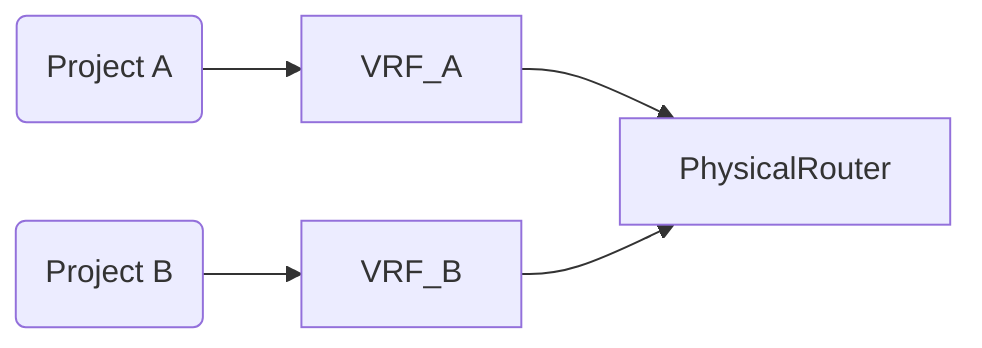
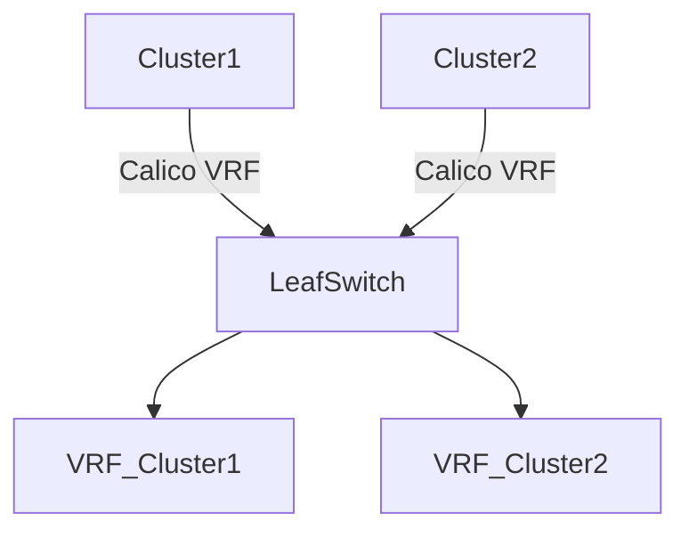

VRF（Virtual Routing and Forwarding）是网络虚拟化的核心技术之一，它在物理网络设备上创建多个 ​**​ 隔离的虚拟路由表 ​**​，实现不同业务流量的逻辑分离。下面从原理、实现和应用场景（包括 OpenStack 和 Kubernetes）展开说明：

# ​ 一、VRF 核心原理 ​​

1. ​**​ 路由隔离 ​**​  
   每个 VRF 实例拥有独立的路由表（含 IP 路由、ARP 表、MAC 表），不同 VRF 间的路由信息互不可见。
2. ​**​ 转发隔离 ​**​  
   属于不同 VRF 的数据包在链路层/三层完全隔离（类似多个虚拟路由器并行运行）。
3. ​**​ 接口绑定机制 ​**​  
   物理/逻辑接口需显式绑定到特定 VRF（如 `ip vrf forwarding vrf-name`），接口收到的流量自动关联对应 VRF 实例。
4. ​**​ 策略控制 ​**​  
   通过路由策略（Route Policy）控制不同 VRF 间的路由泄露（Route Leaking），实现有限互通。

> ​**​ 通俗比喻 ​**​：  
> 想象一栋公寓楼，每个租户（VRF）有独立信箱（路由表）和专用通道（接口）。租户 A 的信件不会误投到租户 B 的信箱，但物业（管理员）可配置特殊规则允许部分信件互通。

# ​​ 二、典型应用场景 ​​

## 1. 传统企业/运营商网络 ​​

-   ​**​ 多租户隔离 ​**​  
     企业总部与分支机构通过 MPLS VPN 共享物理设备，但财务、生产等部门的流量完全隔离。
-   ​**​ 业务隔离 ​**​  
     同一设备同时承载办公网、视频监控网、IoT 网络，避免 IP 地址冲突（如重叠的 192.168.1.0/24 网段）。

## ​​2. OpenStack 场景 ​​

-   ​**​Neutron 多项目网络隔离 ​**​



-   ​**​ 原理 ​**​：Neutron 通过`provider networks`将不同租户的网络绑定到物理交换机的独立 VRF。
-   ​**​ 优势 ​**​：避免租户间路由泄露，硬件资源复用率提升 50%+（对比独立物理设备）。

-   ​**​ 混合云互联 ​**​  
     企业本地 IDC（VRF_Corp）与公有云 VPC（VRF_Cloud）通过 VPN/专线互联，隔离生产与测试流量。

## ​3. Kubernetes 场景 ​​

-   ​**​ 多集群网络融合 ​**​



-   ​**​CNI 插件集成 ​**​：Calico 支持通过`BGP Configuration`声明 Pod 网段注入到物理设备 VRF。
-   ​**​ 应用场景 ​**​：

    -   ​**​ 开发/生产集群共存 ​**​：开发集群（VRF_Dev）与生产集群（VRF_Prod）共享底层 Spine-Leaf 架构。
    -   ​**​ 边缘计算 ​**​：每个边缘站点（Edge Site）对应独立 VRF，通过 SD-WAN 回传核心集群。

-   ​**​ 微服务安全隔离 ​**​  
     金融服务类 Pod 绑定到 VRF_Finance，禁止与外部测试环境通信（策略：`deny from vrf_Test`）。

# ​​ 三、关键技术实现 ​​

## ​​OpenStack 集成示例 ​​

```
# 物理交换机配置（Cisco IOS）
vrf definition tenant-a
 rd 65000:100
!
interface GigabitEthernet0/1
 ip vrf forwarding tenant-a
 ip address 10.0.1.1/24
```

OpenStack Neutron 配置：

```ini
# neutron.conf
[ml2_odl]
tenant_network_types = vlan
provider_vlan_ranges = physnet1:1000:2000
```

```bash
# 网络创建命令
openstack network create --provider-physical-network physnet1 \
                         --provider-network-type vlan \
                         --provider-segment 1001 net-tenant-a
```

## ​Kubernetes 集成（Calico）​​

```yaml
# calico-network-policy.yaml
apiVersion: projectcalico.org/v3
kind: BGPConfiguration
metadata:
    name: vrf-cluster1
spec:
    logSeverityScreen: Info
    asNumber: 63400
    serviceClusterIPs:
        - cidr: 10.96.0.0/12
    vrf: vrf_cluster1 # 绑定物理设备VRF
```

# ​ 四、VRF 的核心价值 ​​

| 维度     | 传统网络          | VRF 解决方案     |
| -------- | ----------------- | ---------------- |
| 隔离性   | VLAN 仅隔离二层   | 二/三层完全隔离  |
| 地址复用 | 需 NAT 或独立设备 | 直接重叠 IP 部署 |
| 运维成本 | 每业务独立设备    | 单设备多虚拟实例 |
| 扩展性   | 硬件瓶颈          | 虚拟实例按需创建 |

# ​ 五、常见问题解答（FAQ）​​

​**​Q：VRF 与 VLAN 有何区别？​**​  
A：VLAN 是二层隔离（MAC 地址隔离），VRF 是三层隔离（IP 路由隔离）。VRF 可包含多个 VLAN，反之不成立。

​**​Q：OpenStack 中所有租户必须用 VRF 吗？​**​  
A：非必须。小型私有云可用 Overlay（VXLAN/GRE），大型云或混合云推荐 VRF+Underlay 架构。

​**​Q：K8s Pod 如何绑定到 VRF？​**​  
A：需 CNI 插件支持（如 Calico、Cilium），通过 Annotations 或 BGP 策略将 Pod CIDR 发布到指定 VRF 路由表。

> ​**​ 最后建议 ​**​：  
> 在金融/医疗等强合规场景，优先使用 VRF+ACL 组合，比纯 Overlay 方案更易通过等保/PCI-DSS 审计。
